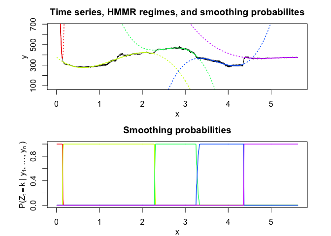
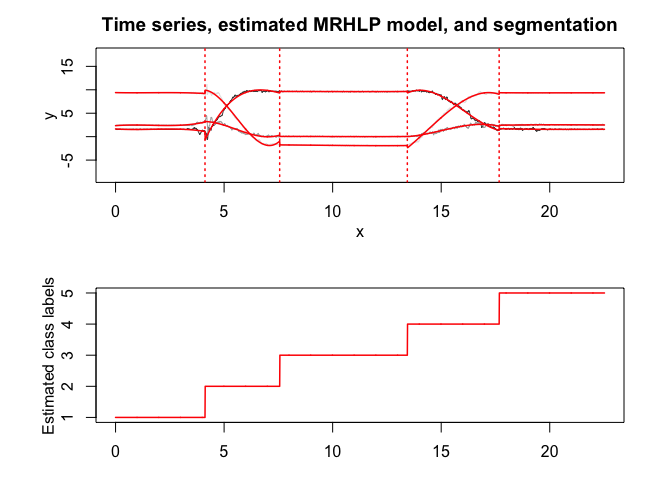

<!-- README.md is generated from README.Rmd. Please edit that file -->

# **SaMUraiS**: **S**t**A**tistical **M**odels for the **U**nsupe**R**vised segment**A**t**I**on of time-**S**eries

<!-- badges: start -->

[](https://travis-ci.org/fchamroukhi/SaMUraiS)
<!-- badges: end -->

samurais is an open source toolbox (available in R and in Matlab)
including many original and flexible user-friendly statistical latent
variable models and unsupervised algorithms to segment and represent,
time-series data (univariate or multivariate), and more generally,
longitudinal data which include regime changes.

Our samurais use mainly the following efficient “sword” packages to
segment data: Regression with Hidden Logistic Process (**RHLP**), Hidden
Markov Model Regression (**HMMR**), Piece-Wise regression (**PWR**),
Multivariate ‘RHLP’ (**MRHLP**), and Multivariate ‘HMMR’ (**MHMMR**).

The models and algorithms are developed and written in Matlab by Faicel
Chamroukhi, and translated and designed into R packages by Florian
Lecocq, Marius Bartcus and Faicel Chamroukhi.

# Installation

You can install the **samurais** package from
[GitHub](https://github.com/fchamroukhi/SaMUraiS) with:

``` r
# install.packages("devtools")
devtools::install_github("fchamroukhi/SaMUraiS")
```

To build *vignettes* for examples of usage, type the command below
instead:

``` r
# install.packages("devtools")
devtools::install_github("fchamroukhi/SaMUraiS", 
                         build_opts = c("--no-resave-data", "--no-manual"), 
                         build_vignettes = TRUE)
```

Use the following command to display vignettes:

``` r
browseVignettes("samurais")
```

# Usage

``` r
library(samurais)
```

<details>

<summary>RHLP</summary>

``` r
# Application to a toy data set
data("univtoydataset")

K <- 5 # Number of regimes (mixture components)
p <- 3 # Dimension of beta (order of the polynomial regressors)
q <- 1 # Dimension of w (order of the logistic regression: to be set to 1 for segmentation)
variance_type <- "heteroskedastic" # "heteroskedastic" or "homoskedastic" model

n_tries <- 1
max_iter = 1500
threshold <- 1e-6
verbose <- TRUE
verbose_IRLS <- FALSE

rhlp <- emRHLP(univtoydataset$x, univtoydataset$y, K, p, q, 
               variance_type, n_tries, max_iter, threshold, 
               verbose, verbose_IRLS)
#> EM: Iteration : 1 || log-likelihood : -2119.27308534609
#> EM: Iteration : 2 || log-likelihood : -1149.01040321999
#> EM: Iteration : 3 || log-likelihood : -1118.20384281234
#> EM: Iteration : 4 || log-likelihood : -1096.88260636121
#> EM: Iteration : 5 || log-likelihood : -1067.55719357295
#> EM: Iteration : 6 || log-likelihood : -1037.26620122646
#> EM: Iteration : 7 || log-likelihood : -1022.71743069484
#> EM: Iteration : 8 || log-likelihood : -1006.11825447077
#> EM: Iteration : 9 || log-likelihood : -1001.18491883952
#> EM: Iteration : 10 || log-likelihood : -1000.91250763556
#> EM: Iteration : 11 || log-likelihood : -1000.62280600209
#> EM: Iteration : 12 || log-likelihood : -1000.3030988811
#> EM: Iteration : 13 || log-likelihood : -999.932334880131
#> EM: Iteration : 14 || log-likelihood : -999.484219706691
#> EM: Iteration : 15 || log-likelihood : -998.928118038989
#> EM: Iteration : 16 || log-likelihood : -998.234244664472
#> EM: Iteration : 17 || log-likelihood : -997.359536276056
#> EM: Iteration : 18 || log-likelihood : -996.152654857298
#> EM: Iteration : 19 || log-likelihood : -994.697863447307
#> EM: Iteration : 20 || log-likelihood : -993.186583974542
#> EM: Iteration : 21 || log-likelihood : -991.81352379631
#> EM: Iteration : 22 || log-likelihood : -990.611295217008
#> EM: Iteration : 23 || log-likelihood : -989.539226273251
#> EM: Iteration : 24 || log-likelihood : -988.55311887915
#> EM: Iteration : 25 || log-likelihood : -987.539963690533
#> EM: Iteration : 26 || log-likelihood : -986.073920116541
#> EM: Iteration : 27 || log-likelihood : -983.263549878169
#> EM: Iteration : 28 || log-likelihood : -979.340492188909
#> EM: Iteration : 29 || log-likelihood : -977.468559852711
#> EM: Iteration : 30 || log-likelihood : -976.653534236095
#> EM: Iteration : 31 || log-likelihood : -976.5893387433
#> EM: Iteration : 32 || log-likelihood : -976.589338067237

rhlp$summary()
#> ---------------------
#> Fitted RHLP model
#> ---------------------
#> 
#> RHLP model with K = 5 components:
#> 
#>  log-likelihood nu       AIC       BIC       ICL
#>       -976.5893 33 -1009.589 -1083.959 -1083.176
#> 
#> Clustering table (Number of observations in each regimes):
#> 
#>   1   2   3   4   5 
#> 100 120 200 100 150 
#> 
#> Regression coefficients:
#> 
#>       Beta(K = 1) Beta(K = 2) Beta(K = 3) Beta(K = 4) Beta(K = 5)
#> 1    6.031875e-02   -5.434903   -2.770416    120.7699    4.027542
#> X^1 -7.424718e+00  158.705091   43.879453   -474.5888   13.194261
#> X^2  2.931652e+02 -650.592347  -94.194780    597.7948  -33.760603
#> X^3 -1.823560e+03  865.329795   67.197059   -244.2386   20.402153
#> 
#> Variances:
#> 
#>  Sigma2(K = 1) Sigma2(K = 2) Sigma2(K = 3) Sigma2(K = 4) Sigma2(K = 5)
#>       1.220624      1.110243      1.079394     0.9779734      1.028332

rhlp$plot()
```


``` r
# Application to a real data set
data("univrealdataset")

K <- 5 # Number of regimes (mixture components)
p <- 3 # Dimension of beta (order of the polynomial regressors)
q <- 1 # Dimension of w (order of the logistic regression: to be set to 1 for segmentation)
variance_type <- "heteroskedastic" # "heteroskedastic" or "homoskedastic" model

n_tries <- 1
max_iter = 1500
threshold <- 1e-6
verbose <- FALSE
verbose_IRLS <- FALSE

rhlp <- emRHLP(univrealdataset$x, univrealdataset$y2, K, p, q, 
               variance_type, n_tries, max_iter, threshold, 
               verbose, verbose_IRLS)

rhlp$summary()
#> ---------------------
#> Fitted RHLP model
#> ---------------------
#> 
#> RHLP model with K = 5 components:
#> 
#>  log-likelihood nu       AIC       BIC       ICL
#>       -1946.213 33 -1979.213 -2050.683 -2050.449
#> 
#> Clustering table (Number of observations in each regimes):
#> 
#>   1   2   3   4   5 
#>  16 129 180 111 126 
#> 
#> Regression coefficients:
#> 
#>     Beta(K = 1) Beta(K = 2) Beta(K = 3) Beta(K = 4) Beta(K = 5)
#> 1      2187.539   330.05723   1508.2809 -13446.7332  6417.62830
#> X^1  -15032.659  -107.79782  -1648.9562  11321.4509 -3571.94090
#> X^2  -56433.432    14.40154    786.5723  -3062.2825   699.55894
#> X^3  494014.670    56.88016   -118.0693    272.7844   -45.42922
#> 
#> Variances:
#> 
#>  Sigma2(K = 1) Sigma2(K = 2) Sigma2(K = 3) Sigma2(K = 4) Sigma2(K = 5)
#>       8924.363      49.22616       78.2758      105.6606      15.66317

rhlp$plot()
```


</details>

<details>

<summary>HMMR</summary>

``` r
# Application to a toy data set
data("univtoydataset")

K <- 5 # Number of regimes (states)
p <- 3 # Dimension of beta (order of the polynomial regressors)
variance_type <- "heteroskedastic" # "heteroskedastic" or "homoskedastic" model

n_tries <- 1
max_iter <- 1500
threshold <- 1e-6
verbose <- TRUE

hmmr <- emHMMR(univtoydataset$x, univtoydataset$y, K, p, variance_type, 
               n_tries, max_iter, threshold, verbose)
#> EM: Iteration : 1 || log-likelihood : -1556.39696825601
#> EM: Iteration : 2 || log-likelihood : -1022.47935723687
#> EM: Iteration : 3 || log-likelihood : -1019.51830707432
#> EM: Iteration : 4 || log-likelihood : -1019.51780361388

hmmr$summary()
#> ---------------------
#> Fitted HMMR model
#> ---------------------
#> 
#> HMMR model with K = 5 components:
#> 
#>  log-likelihood nu       AIC       BIC
#>       -1019.518 49 -1068.518 -1178.946
#> 
#> Clustering table (Number of observations in each regimes):
#> 
#>   1   2   3   4   5 
#> 100 120 200 100 150 
#> 
#> Regression coefficients:
#> 
#>       Beta(K = 1) Beta(K = 2) Beta(K = 3) Beta(K = 4) Beta(K = 5)
#> 1    6.031872e-02   -5.326689    -2.65064    120.8612    3.858683
#> X^1 -7.424715e+00  157.189455    43.13601   -474.9870   13.757279
#> X^2  2.931651e+02 -643.706204   -92.68115    598.3726  -34.384734
#> X^3 -1.823559e+03  855.171715    66.18499   -244.5175   20.632196
#> 
#> Variances:
#> 
#>  Sigma2(K = 1) Sigma2(K = 2) Sigma2(K = 3) Sigma2(K = 4) Sigma2(K = 5)
#>       1.220624      1.111487      1.080043     0.9779724      1.028399

hmmr$plot(what = c("smoothed", "regressors", "loglikelihood"))
```


``` r
# Application to a real data set
data("univrealdataset")

K <- 5 # Number of regimes (states)
p <- 3 # Dimension of beta (order of the polynomial regressors)
variance_type <- "heteroskedastic" # "heteroskedastic" or "homoskedastic" model

n_tries <- 1
max_iter <- 1500
threshold <- 1e-6
verbose <- TRUE

hmmr <- emHMMR(univrealdataset$x, univrealdataset$y2, K, p, variance_type, 
               n_tries, max_iter, threshold, verbose)
#> EM: Iteration : 1 || log-likelihood : -2733.41028643114
#> EM: Iteration : 2 || log-likelihood : -2303.24018378559
#> EM: Iteration : 3 || log-likelihood : -2295.0470677529
#> EM: Iteration : 4 || log-likelihood : -2288.57866215726
#> EM: Iteration : 5 || log-likelihood : -2281.36756202518
#> EM: Iteration : 6 || log-likelihood : -2273.50303676091
#> EM: Iteration : 7 || log-likelihood : -2261.70334656117
#> EM: Iteration : 8 || log-likelihood : -2243.43509121433
#> EM: Iteration : 9 || log-likelihood : -2116.4610801575
#> EM: Iteration : 10 || log-likelihood : -2046.73194777839
#> EM: Iteration : 11 || log-likelihood : -2046.68328282973
#> EM: Iteration : 12 || log-likelihood : -2046.67329222076
#> EM: Iteration : 13 || log-likelihood : -2046.66915144265
#> EM: Iteration : 14 || log-likelihood : -2046.66694236131
#> EM: Iteration : 15 || log-likelihood : -2046.66563379017

hmmr$summary()
#> ---------------------
#> Fitted HMMR model
#> ---------------------
#> 
#> HMMR model with K = 5 components:
#> 
#>  log-likelihood nu       AIC       BIC
#>       -2046.666 49 -2095.666 -2201.787
#> 
#> Clustering table (Number of observations in each regimes):
#> 
#>   1   2   3   4   5 
#>  14 214  99 109 126 
#> 
#> Regression coefficients:
#> 
#>     Beta(K = 1) Beta(K = 2) Beta(K = 3) Beta(K = 4) Beta(K = 5)
#> 1       2152.64   379.75158   5211.1759 -14306.4654  6417.62823
#> X^1   -12358.67  -373.37266  -5744.7879  11987.6666 -3571.94086
#> X^2  -103908.33   394.49359   2288.9418  -3233.8021   699.55894
#> X^3   722173.26   -98.60485   -300.7686    287.4567   -45.42922
#> 
#> Variances:
#> 
#>  Sigma2(K = 1) Sigma2(K = 2) Sigma2(K = 3) Sigma2(K = 4) Sigma2(K = 5)
#>       9828.793      125.3346      58.71053      105.8328      15.66317

hmmr$plot(what = c("smoothed", "regressors", "loglikelihood"))
```



</details>

<details>

<summary>PWR</summary>

``` r
# Application to a toy data set
data("univtoydataset")

K <- 5 # Number of segments
p <- 1 # Polynomial degree

pwr <- fitPWRFisher(univtoydataset$x, univtoydataset$y, K, p)

pwr$plot()
```


``` r
# Application to a real data set
data("univrealdataset")

K <- 5 # Number of segments
p <- 3 # Polynomial degree

pwr <- fitPWRFisher(univrealdataset$x, univrealdataset$y2, K, p)

pwr$plot()
```


</details>

<details>

<summary>MRHLP</summary>

``` r
# Application to a toy data set
data("multivtoydataset")

K <- 5 # Number of regimes (mixture components)
p <- 1 # Dimension of beta (order of the polynomial regressors)
q <- 1 # Dimension of w (order of the logistic regression: to be set to 1 for segmentation)
variance_type <- "heteroskedastic" # "heteroskedastic" or "homoskedastic" model

n_tries <- 1
max_iter <- 1500
threshold <- 1e-6
verbose <- TRUE
verbose_IRLS <- FALSE

mrhlp <- emMRHLP(multivtoydataset$x, multivtoydataset[,c("y1", "y2", "y3")], 
                 K, p, q, variance_type, n_tries, max_iter, threshold, verbose,
                 verbose_IRLS)
#> EM: Iteration : 1 || log-likelihood : -4807.6644322901
#> EM: Iteration : 2 || log-likelihood : -3314.25165556383
#> EM: Iteration : 3 || log-likelihood : -3216.8871750704
#> EM: Iteration : 4 || log-likelihood : -3126.33556053822
#> EM: Iteration : 5 || log-likelihood : -2959.59933830667
#> EM: Iteration : 6 || log-likelihood : -2895.65953485704
#> EM: Iteration : 7 || log-likelihood : -2892.93263500326
#> EM: Iteration : 8 || log-likelihood : -2889.34084959654
#> EM: Iteration : 9 || log-likelihood : -2884.56422084139
#> EM: Iteration : 10 || log-likelihood : -2878.29772085061
#> EM: Iteration : 11 || log-likelihood : -2870.61242183846
#> EM: Iteration : 12 || log-likelihood : -2862.86238149363
#> EM: Iteration : 13 || log-likelihood : -2856.85351443338
#> EM: Iteration : 14 || log-likelihood : -2851.74642203885
#> EM: Iteration : 15 || log-likelihood : -2850.00381259526
#> EM: Iteration : 16 || log-likelihood : -2849.86516522686
#> EM: Iteration : 17 || log-likelihood : -2849.7354103643
#> EM: Iteration : 18 || log-likelihood : -2849.56953544124
#> EM: Iteration : 19 || log-likelihood : -2849.40322468732
#> EM: Iteration : 20 || log-likelihood : -2849.40321381274

mrhlp$summary()
#> ----------------------
#> Fitted MRHLP model
#> ----------------------
#> 
#> MRHLP model with K = 5 regimes
#> 
#>  log-likelihood nu       AIC       BIC       ICL
#>       -2849.403 68 -2917.403 -3070.651 -3069.896
#> 
#> Clustering table:
#>   1   2   3   4   5 
#> 100 120 200 100 150 
#> 
#> 
#> ------------------
#> Regime 1 (K = 1):
#> 
#> Regression coefficients:
#> 
#>     Beta(d = 1) Beta(d = 2) Beta(d = 3)
#> 1    0.11943184   0.6087582   -2.038486
#> X^1 -0.08556857   4.1038126    2.540536
#> 
#> Covariance matrix:
#>                                    
#>  1.19063336  0.12765794  0.05537134
#>  0.12765794  0.87144062 -0.05213162
#>  0.05537134 -0.05213162  0.87885166
#> ------------------
#> Regime 2 (K = 2):
#> 
#> Regression coefficients:
#> 
#>     Beta(d = 1) Beta(d = 2) Beta(d = 3)
#> 1      6.924025   4.9368460   10.288339
#> X^1    1.118034   0.4726707   -1.409218
#> 
#> Covariance matrix:
#>                                   
#>   1.0690431 -0.18293369 0.12602459
#>  -0.1829337  1.05280632 0.01390041
#>   0.1260246  0.01390041 0.75995058
#> ------------------
#> Regime 3 (K = 3):
#> 
#> Regression coefficients:
#> 
#>     Beta(d = 1) Beta(d = 2) Beta(d = 3)
#> 1     3.6535241   6.3654379    8.488318
#> X^1   0.6233579  -0.8866887   -1.126692
#> 
#> Covariance matrix:
#>                                     
#>   1.02591553 -0.05445227 -0.02019896
#>  -0.05445227  1.18941700  0.01565240
#>  -0.02019896  0.01565240  1.00257195
#> ------------------
#> Regime 4 (K = 4):
#> 
#> Regression coefficients:
#> 
#>     Beta(d = 1) Beta(d = 2) Beta(d = 3)
#> 1     -1.439637   -4.463014    2.952470
#> X^1    0.703211    3.649717   -4.187703
#> 
#> Covariance matrix:
#>                                     
#>   0.88000190 -0.03249118 -0.03411075
#>  -0.03249118  1.12087583 -0.07881351
#>  -0.03411075 -0.07881351  0.86060127
#> ------------------
#> Regime 5 (K = 5):
#> 
#> Regression coefficients:
#> 
#>     Beta(d = 1) Beta(d = 2) Beta(d = 3)
#> 1     3.4982408   2.5357751    7.652113
#> X^1   0.0574791  -0.7286824   -3.005802
#> 
#> Covariance matrix:
#>                                  
#>  1.13330209 0.25869951 0.03163467
#>  0.25869951 1.21230741 0.04746018
#>  0.03163467 0.04746018 0.80241715

mrhlp$plot()
```


``` r
# Application to a real data set (human activity recogntion data)
data("multivrealdataset")

K <- 5 # Number of regimes (mixture components)
p <- 3 # Dimension of beta (order of the polynomial regressors)
q <- 1 # Dimension of w (order of the logistic regression: to be set to 1 for segmentation)
variance_type <- "heteroskedastic" # "heteroskedastic" or "homoskedastic" model

n_tries <- 1
max_iter <- 1500
threshold <- 1e-6
verbose <- TRUE
verbose_IRLS <- FALSE

mrhlp <- emMRHLP(multivrealdataset$x, multivrealdataset[,c("y1", "y2", "y3")], 
                 K, p, q, variance_type, n_tries, max_iter, threshold, verbose,
                 verbose_IRLS)
#> EM: Iteration : 1 || log-likelihood : -792.888668727036
#> EM: Iteration : 2 || log-likelihood : 6016.45835957306
#> EM: Iteration : 3 || log-likelihood : 6362.81791662824
#> EM: Iteration : 4 || log-likelihood : 6615.72233403002
#> EM: Iteration : 5 || log-likelihood : 6768.32107943849
#> EM: Iteration : 6 || log-likelihood : 6840.97339565987
#> EM: Iteration : 7 || log-likelihood : 6860.97262839295
#> EM: Iteration : 8 || log-likelihood : 6912.25605673784
#> EM: Iteration : 9 || log-likelihood : 6945.96718258737
#> EM: Iteration : 10 || log-likelihood : 6951.28584396645
#> EM: Iteration : 11 || log-likelihood : 6952.37644678517
#> EM: Iteration : 12 || log-likelihood : 6954.80510338749
#> EM: Iteration : 13 || log-likelihood : 6958.99033092484
#> EM: Iteration : 14 || log-likelihood : 6964.81099837456
#> EM: Iteration : 15 || log-likelihood : 6999.90358068156
#> EM: Iteration : 16 || log-likelihood : 7065.39327246318
#> EM: Iteration : 17 || log-likelihood : 7166.23398344994
#> EM: Iteration : 18 || log-likelihood : 7442.73330846285
#> EM: Iteration : 19 || log-likelihood : 7522.65416438396
#> EM: Iteration : 20 || log-likelihood : 7524.41524338024
#> EM: Iteration : 21 || log-likelihood : 7524.57590110924
#> EM: Iteration : 22 || log-likelihood : 7524.73808801417
#> EM: Iteration : 23 || log-likelihood : 7524.88684996651
#> EM: Iteration : 24 || log-likelihood : 7524.9753964817
#> EM: Iteration : 25 || log-likelihood : 7524.97701548847

mrhlp$summary()
#> ----------------------
#> Fitted MRHLP model
#> ----------------------
#> 
#> MRHLP model with K = 5 regimes
#> 
#>  log-likelihood nu      AIC      BIC      ICL
#>        7524.977 98 7426.977 7146.696 7147.535
#> 
#> Clustering table:
#>   1   2   3   4   5 
#> 413 344 588 423 485 
#> 
#> 
#> ------------------
#> Regime 1 (K = 1):
#> 
#> Regression coefficients:
#> 
#>     Beta(d = 1) Beta(d = 2) Beta(d = 3)
#> 1    1.64847721  2.33823068  9.40173242
#> X^1 -0.31396583  0.38235782 -0.10031616
#> X^2  0.23954454 -0.30105177  0.07812145
#> X^3 -0.04725267  0.06166899 -0.01586579
#> 
#> Covariance matrix:
#>                                          
#>   0.0200740364 -0.004238036  0.0004011388
#>  -0.0042380363  0.006082904 -0.0012973026
#>   0.0004011388 -0.001297303  0.0013201963
#> ------------------
#> Regime 2 (K = 2):
#> 
#> Regression coefficients:
#> 
#>      Beta(d = 1) Beta(d = 2)  Beta(d = 3)
#> 1   -106.0250571 -31.4671946 -107.9697464
#> X^1   45.2035210  21.2126134   72.0220177
#> X^2   -5.7330338  -4.1285514  -13.9857795
#> X^3    0.2343552   0.2485377    0.8374817
#> 
#> Covariance matrix:
#>                                     
#>   0.11899225 -0.03866052 -0.06693441
#>  -0.03866052  0.17730401  0.04036629
#>  -0.06693441  0.04036629  0.11983979
#> ------------------
#> Regime 3 (K = 3):
#> 
#> Regression coefficients:
#> 
#>       Beta(d = 1)  Beta(d = 2)  Beta(d = 3)
#> 1    9.0042249443 -1.247752962 -2.492119515
#> X^1  0.2191555621  0.418071041  0.310449523
#> X^2 -0.0242080660 -0.043802827 -0.039012607
#> X^3  0.0008494208  0.001474635  0.001427627
#> 
#> Covariance matrix:
#>                                          
#>   4.103351e-04 -0.0001330363 5.289199e-05
#>  -1.330363e-04  0.0006297205 2.027763e-04
#>   5.289199e-05  0.0002027763 1.374405e-03
#> ------------------
#> Regime 4 (K = 4):
#> 
#> Regression coefficients:
#> 
#>       Beta(d = 1) Beta(d = 2)  Beta(d = 3)
#> 1   -1029.9071752 334.4975068  466.0981076
#> X^1   199.9531885 -68.7252041 -105.6436899
#> X^2   -12.6550086   4.6489685    7.6555642
#> X^3     0.2626998  -0.1032161   -0.1777453
#> 
#> Covariance matrix:
#>                                       
#>   0.058674116 -0.017661572 0.002139975
#>  -0.017661572  0.047588713 0.007867532
#>   0.002139975  0.007867532 0.067150809
#> ------------------
#> Regime 5 (K = 5):
#> 
#> Regression coefficients:
#> 
#>      Beta(d = 1)   Beta(d = 2)  Beta(d = 3)
#> 1   27.247199195 -14.393798357 19.741283724
#> X^1 -3.530625667   2.282492947 -1.511225702
#> X^2  0.161234880  -0.101613670  0.073003292
#> X^3 -0.002446104   0.001490288 -0.001171127
#> 
#> Covariance matrix:
#>                                          
#>   6.900384e-03 -0.001176838  2.966199e-05
#>  -1.176838e-03  0.003596238 -2.395420e-04
#>   2.966199e-05 -0.000239542  5.573451e-04

mrhlp$plot()
```



</details>

<details>

<summary>MHMMR</summary>

``` r
# Application to a simulated data set
data("multivtoydataset")

K <- 5 # Number of regimes (states)
p <- 1 # Dimension of beta (order of the polynomial regressors)
variance_type <- "heteroskedastic" # "heteroskedastic" or "homoskedastic" model

n_tries <- 1
max_iter <- 1500
threshold <- 1e-6
verbose <- TRUE

mhmmr <- emMHMMR(multivtoydataset$x, multivtoydataset[, c("y1", "y2", "y3")],
                 K, p, variance_type, n_tries, max_iter, threshold, verbose)
#> EM: Iteration : 1 || log-likelihood : -4539.37845473736
#> EM: Iteration : 2 || log-likelihood : -3075.7862970485
#> EM: Iteration : 3 || log-likelihood : -2904.71126233611
#> EM: Iteration : 4 || log-likelihood : -2883.23456594806
#> EM: Iteration : 5 || log-likelihood : -2883.12446634454
#> EM: Iteration : 6 || log-likelihood : -2883.12436399888

mhmmr$summary()
#> ----------------------
#> Fitted MHMMR model
#> ----------------------
#> 
#> MHMMR model with K = 5 regimes
#> 
#>  log-likelihood nu       AIC      BIC
#>       -2883.124 84 -2967.124 -3156.43
#> 
#> Clustering table:
#>   1   2   3   4   5 
#> 100 120 200 100 150 
#> 
#> 
#> ------------------
#> Regime 1 (K = 1):
#> 
#> Regression coefficients:
#> 
#>     Beta(d = 1) Beta(d = 2) Beta(d = 3)
#> 1    0.11943184   0.6087582   -2.038486
#> X^1 -0.08556857   4.1038126    2.540536
#> 
#> Covariance matrix:
#>                                    
#>  1.19064336  0.12765794  0.05537134
#>  0.12765794  0.87145062 -0.05213162
#>  0.05537134 -0.05213162  0.87886166
#> ------------------
#> Regime 2 (K = 2):
#> 
#> Regression coefficients:
#> 
#>     Beta(d = 1) Beta(d = 2) Beta(d = 3)
#> 1      6.921139   4.9377164   10.290536
#> X^1    1.131946   0.4684922   -1.419758
#> 
#> Covariance matrix:
#>                                   
#>   1.0688949 -0.18240787 0.12675972
#>  -0.1824079  1.05317924 0.01419686
#>   0.1267597  0.01419686 0.76030310
#> ------------------
#> Regime 3 (K = 3):
#> 
#> Regression coefficients:
#> 
#>     Beta(d = 1) Beta(d = 2) Beta(d = 3)
#> 1     3.6576562   6.3642526    8.493765
#> X^1   0.6155173  -0.8844373   -1.137027
#> 
#> Covariance matrix:
#>                                     
#>   1.02647251 -0.05491451 -0.01930098
#>  -0.05491451  1.18921808  0.01510035
#>  -0.01930098  0.01510035  1.00352482
#> ------------------
#> Regime 4 (K = 4):
#> 
#> Regression coefficients:
#> 
#>     Beta(d = 1) Beta(d = 2) Beta(d = 3)
#> 1     -1.439637   -4.463014    2.952470
#> X^1    0.703211    3.649717   -4.187703
#> 
#> Covariance matrix:
#>                                     
#>   0.88001190 -0.03249118 -0.03411075
#>  -0.03249118  1.12088583 -0.07881351
#>  -0.03411075 -0.07881351  0.86061127
#> ------------------
#> Regime 5 (K = 5):
#> 
#> Regression coefficients:
#> 
#>     Beta(d = 1) Beta(d = 2) Beta(d = 3)
#> 1     3.4982408   2.5357751    7.652113
#> X^1   0.0574791  -0.7286824   -3.005802
#> 
#> Covariance matrix:
#>                                  
#>  1.13331209 0.25869951 0.03163467
#>  0.25869951 1.21231741 0.04746018
#>  0.03163467 0.04746018 0.80242715

mhmmr$plot(what = c("smoothed", "regressors", "loglikelihood"))
```


``` r
# Application to a real data set (human activity recognition data)
data("multivrealdataset")

K <- 5 # Number of regimes (states)
p <- 3 # Dimension of beta (order of the polynomial regressors)
variance_type <- "heteroskedastic" # "heteroskedastic" or "homoskedastic" model

n_tries <- 1
max_iter <- 1500
threshold <- 1e-6
verbose <- TRUE

mhmmr <- emMHMMR(multivrealdataset$x, multivrealdataset[, c("y1", "y2", "y3")],
                 K, p, variance_type, n_tries, max_iter, threshold, verbose)
#> EM: Iteration : 1 || log-likelihood : 817.206309249687
#> EM: Iteration : 2 || log-likelihood : 1793.49320726452
#> EM: Iteration : 3 || log-likelihood : 1908.47251424374
#> EM: Iteration : 4 || log-likelihood : 2006.7976746047
#> EM: Iteration : 5 || log-likelihood : 3724.91911814713
#> EM: Iteration : 6 || log-likelihood : 3846.02584774854
#> EM: Iteration : 7 || log-likelihood : 3957.04953794437
#> EM: Iteration : 8 || log-likelihood : 4008.60804596975
#> EM: Iteration : 9 || log-likelihood : 4011.09964067314
#> EM: Iteration : 10 || log-likelihood : 4014.35810165377
#> EM: Iteration : 11 || log-likelihood : 4026.38632031497
#> EM: Iteration : 12 || log-likelihood : 4027.13758668835
#> EM: Iteration : 13 || log-likelihood : 4027.13639613206

mhmmr$summary()
#> ----------------------
#> Fitted MHMMR model
#> ----------------------
#> 
#> MHMMR model with K = 5 regimes
#> 
#>  log-likelihood  nu      AIC      BIC
#>        4027.136 114 3913.136 3587.095
#> 
#> Clustering table:
#>   1   2   3   4   5 
#> 461 297 587 423 485 
#> 
#> 
#> ------------------
#> Regime 1 (K = 1):
#> 
#> Regression coefficients:
#> 
#>     Beta(d = 1) Beta(d = 2)  Beta(d = 3)
#> 1    1.41265303  2.42222746  9.381994682
#> X^1  0.47242692  0.09217574 -0.023282898
#> X^2 -0.28135064 -0.10169173  0.018998710
#> X^3  0.04197568  0.02620151 -0.004217078
#> 
#> Covariance matrix:
#>                                       
#>   0.12667921 -0.019381009 -0.018810846
#>  -0.01938101  0.109202105 -0.001402791
#>  -0.01881085 -0.001402791  0.026461790
#> ------------------
#> Regime 2 (K = 2):
#> 
#> Regression coefficients:
#> 
#>     Beta(d = 1) Beta(d = 2) Beta(d = 3)
#> 1    -3.6868321   2.4724043    7.794639
#> X^1  -6.8471097   4.6786664   14.749215
#> X^2   2.9742521  -1.4716819   -4.646020
#> X^3  -0.2449644   0.1076065    0.335142
#> 
#> Covariance matrix:
#>                                      
#>   0.22604244 -0.032716477 0.013626769
#>  -0.03271648  0.032475350 0.008585402
#>   0.01362677  0.008585402 0.041960228
#> ------------------
#> Regime 3 (K = 3):
#> 
#> Regression coefficients:
#> 
#>      Beta(d = 1)  Beta(d = 2)   Beta(d = 3)
#> 1    0.776245522  0.014437427 -0.1144683124
#> X^1  2.627158141  0.048519275 -0.3883099866
#> X^2 -0.255314738 -0.008318957  0.0283047828
#> X^3  0.008129981  0.000356239 -0.0007003718
#> 
#> Covariance matrix:
#>                                           
#>   0.0012000978 -0.0002523608 -0.0001992900
#>  -0.0002523608  0.0006584694  0.0002391577
#>  -0.0001992900  0.0002391577  0.0014228769
#> ------------------
#> Regime 4 (K = 4):
#> 
#> Regression coefficients:
#> 
#>      Beta(d = 1)   Beta(d = 2)  Beta(d = 3)
#> 1    0.002894474 -0.0002900823 -0.001513232
#> X^1  0.029936273 -0.0029993910 -0.015647636
#> X^2  0.232798943 -0.0233058753 -0.121611904
#> X^3 -0.013209774  0.0019141508  0.009151938
#> 
#> Covariance matrix:
#>                                     
#>   0.21455830 -0.07328139 -0.08824736
#>  -0.07328139  0.17055704  0.45218611
#>  -0.08824736  0.45218611  1.76616982
#> ------------------
#> Regime 5 (K = 5):
#> 
#> Regression coefficients:
#> 
#>       Beta(d = 1)   Beta(d = 2)   Beta(d = 3)
#> 1    9.416685e-05  0.0001347198  0.0005119141
#> X^1  1.259159e-03  0.0018014389  0.0068451694
#> X^2  1.265758e-02  0.0181095390  0.0688126905
#> X^3 -4.344666e-04 -0.0005920827 -0.0022723501
#> 
#> Covariance matrix:
#>                                       
#>   0.009259719 -0.000696446 0.006008102
#>  -0.000696446  0.003732296 0.001056145
#>   0.006008102  0.001056145 0.016144263

mhmmr$plot(what = c("smoothed", "regressors", "loglikelihood"))
```


</details>

# Model selection

In this package, it is possible to select models based on information
criteria such as **BIC**, **AIC** and **ICL**.

The selection can be done for the two following parameters:

  - **K**: The number of regimes;
  - **p**: The order of the polynomial regression.

<details>

<summary>RHLP</summary>

Let’s select a RHLP model for the following time series **Y**:

``` r
data("univtoydataset")
x = univtoydataset$x
y = univtoydataset$y

plot(x, y, type = "l", xlab = "x", ylab = "Y")
```


``` r
selectedrhlp <- selectRHLP(X = x, Y = y, Kmin = 2, Kmax = 6, pmin = 0, pmax = 3)
#> The RHLP model selected via the "BIC" has K = 5 regimes 
#>  and the order of the polynomial regression is p = 0.
#> BIC = -1041.40789532438
#> AIC = -1000.84239591291

selectedrhlp$plot(what = "estimatedsignal")
```


</details>

<details>

<summary>HMMR</summary>

Let’s select a HMMR model for the following time series **Y**:

``` r
data("univtoydataset")
x = univtoydataset$x
y = univtoydataset$y

plot(x, y, type = "l", xlab = "x", ylab = "Y")
```


``` r
selectedhmmr <- selectHMMR(X = x, Y = y, Kmin = 2, Kmax = 6, pmin = 0, pmax = 3)
#> The HMMR model selected via the "BIC" has K = 5 regimes 
#>  and the order of the polynomial regression is p = 0.
#> BIC = -1136.39152222095
#> AIC = -1059.76780111041

selectedhmmr$plot(what = "smoothed")
```


</details>

<details>

<summary>MRHLP</summary>

Let’s select a MRHLP model for the following multivariate time series
**Y**:

<br />

``` r
data("multivtoydataset")
x <- multivtoydataset$x
y <- multivtoydataset[, c("y1", "y2", "y3")]
matplot(x, y, type = "l", xlab = "x", ylab = "Y", lty = 1)
```


``` r
selectedmrhlp <- selectMRHLP(X = x, Y = y, Kmin = 2, Kmax = 6, pmin = 0, pmax = 3)
#> Warning in emMRHLP(X = X1, Y = Y1, K, p): EM log-likelihood is decreasing
#> from -3105.78591044952to -3105.78627830471 !
#> The MRHLP model selected via the "BIC" has K = 5 regimes 
#>  and the order of the polynomial regression is p = 0.
#> BIC = -3033.20042397111
#> AIC = -2913.75756459291

selectedmrhlp$plot(what = "estimatedsignal")
```


</details>

<details>

<summary>MHMMR</summary>

Let’s select a MHMMR model for the following multivariate time series
**Y**:

``` r
data("multivtoydataset")
x <- multivtoydataset$x
y <- multivtoydataset[, c("y1", "y2", "y3")]
matplot(x, y, type = "l", xlab = "x", ylab = "Y", lty = 1)
```


``` r
selectedmhmmr <- selectMHMMR(X = x, Y = y, Kmin = 2, Kmax = 6, pmin = 0, pmax = 3)
#> The MHMMR model selected via the "BIC" has K = 5 regimes 
#>  and the order of the polynomial regression is p = 0.
#> BIC = -3118.9815385353
#> AIC = -2963.48045745801

selectedmhmmr$plot(what = "smoothed")
```


</details>

# References

<div id="refs" class="references">

<div id="ref-Chamroukhi-FDA-2018">

Chamroukhi, Faicel, and Hien D. Nguyen. 2019. “Model-Based Clustering
and Classification of Functional Data.” *Wiley Interdisciplinary
Reviews: Data Mining and Knowledge Discovery*.
<https://chamroukhi.com/papers/MBCC-FDA.pdf>.

</div>

<div id="ref-Chamroukhi-HDR-2015">

Chamroukhi, F. 2015. “Statistical Learning of Latent Data Models for
Complex Data Analysis.” Habilitation Thesis (HDR), Université de Toulon.
<https://chamroukhi.com/Dossier/FChamroukhi-Habilitation.pdf>.

</div>

<div id="ref-Chamroukhi-MHMMR-2013">

Trabelsi, D., S. Mohammed, F. Chamroukhi, L. Oukhellou, and Y. Amirat.
2013. “An Unsupervised Approach for Automatic Activity Recognition Based
on Hidden Markov Model Regression.” *IEEE Transactions on Automation
Science and Engineering* 3 (10): 829–335.
<https://chamroukhi.com/papers/Chamroukhi-MHMMR-IeeeTase.pdf>.

</div>

<div id="ref-Chamroukhi-MRHLP-2013">

Chamroukhi, F., D. Trabelsi, S. Mohammed, L. Oukhellou, and Y. Amirat.
2013. “Joint Segmentation of Multivariate Time Series with Hidden
Process Regression for Human Activity Recognition.” *Neurocomputing*
120: 633–44.
<https://chamroukhi.com/papers/chamroukhi_et_al_neucomp2013b.pdf>.

</div>

<div id="ref-chamroukhi_et_al_neurocomp2010">

Chamroukhi, F., A. Samé, G. Govaert, and P. Aknin. 2010. “A Hidden
Process Regression Model for Functional Data Description. Application to
Curve Discrimination.” *Neurocomputing* 73 (7-9): 1210–21.
<https://chamroukhi.com/papers/chamroukhi_neucomp_2010.pdf>.

</div>

<div id="ref-Chamroukhi_PhD_2010">

Chamroukhi, F. 2010. “Hidden Process Regression for Curve Modeling,
Classification and Tracking.” Ph.D. Thesis, Université de Technologie de
Compiègne. <https://chamroukhi.com/papers/FChamroukhi-Thesis.pdf>.

</div>

<div id="ref-chamroukhi_et_al_NN2009">

Chamroukhi, F., A. Samé, G. Govaert, and P. Aknin. 2009. “Time Series
Modeling by a Regression Approach Based on a Latent Process.” *Neural
Networks* 22 (5-6): 593–602.
<https://chamroukhi.com/papers/Chamroukhi_Neural_Networks_2009.pdf>.

</div>

</div>
