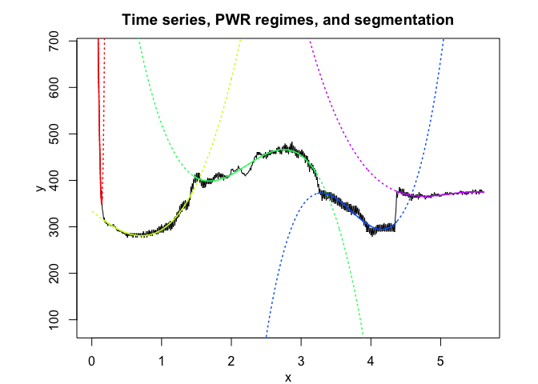

<!-- README.md is generated from README.Rmd. Please edit that file -->

# **SaMUraiS**: **S**t**A**tistical **M**odels for the **U**nsupe**R**vised segment**A**t**I**on of time-**S**eries

<!-- badges: start -->

[](https://travis-ci.org/fchamroukhi/SaMUraiS)
<!-- badges: end -->

samurais is an open source toolbox (available in R and in Matlab)
including many original and flexible user-friendly statistical latent
variable models and unsupervised algorithms to segment and represent,
time-series data (univariate or multivariate), and more generally,
longitudinal data which include regime changes.

Our samurais use mainly the following efficient “sword” packages to
segment data:

  - RHLP;
  - HMM/HMMR;
  - PWR;
  - MRHLP;
  - MHMMR.

The models and algorithms are developed and written in Matlab by Faicel
Chamroukhi, and translated and designed into R packages by Florian
Lecocq, Marius Bartcus and Faicel Chamroukhi.

# Installation

You can install the **samurais** package from
[GitHub](https://github.com/fchamroukhi/SaMUraiS) with:

``` r
# install.packages("devtools")
devtools::install_github("fchamroukhi/SaMUraiS")
```

To build *vignettes* for examples of usage, type the command below
instead:

``` r
# install.packages("devtools")
devtools::install_github("fchamroukhi/SaMUraiS", 
                         build_opts = c("--no-resave-data", "--no-manual"), 
                         build_vignettes = TRUE)
```

Use the following command to display vignettes:

``` r
browseVignettes("samurais")
```

# Usage

<details>

<summary>RHLP</summary>

``` r
library(samurais)

data("univrealdataset")

K <- 5 # Number of regimes (mixture components)
p <- 3 # Dimension of beta (order of the polynomial regressors)
q <- 1 # Dimension of w (order of the logistic regression: to be set to 1 for segmentation)
variance_type <- "heteroskedastic" # "heteroskedastic" or "homoskedastic" model

n_tries <- 1
max_iter = 1500
threshold <- 1e-6
verbose <- TRUE
verbose_IRLS <- FALSE

rhlp <- emRHLP(univrealdataset$x, univrealdataset$y1, K, p, q, 
               variance_type, n_tries, max_iter, threshold, 
               verbose, verbose_IRLS)
#> EM: Iteration : 1 || log-likelihood : -3126.08247039135
#> EM: Iteration : 2 || log-likelihood : -2121.08808475682
#> EM: Iteration : 3 || log-likelihood : -2009.82191410209
#> EM: Iteration : 4 || log-likelihood : -1977.8268328881
#> EM: Iteration : 5 || log-likelihood : -1963.18709732032
#> EM: Iteration : 6 || log-likelihood : -1960.27086117413
#> EM: Iteration : 7 || log-likelihood : -1957.77924311816
#> EM: Iteration : 8 || log-likelihood : -1955.69467955559
#> EM: Iteration : 9 || log-likelihood : -1954.25503722788
#> EM: Iteration : 10 || log-likelihood : -1953.29827499857
#> EM: Iteration : 11 || log-likelihood : -1952.61600575654
#> EM: Iteration : 12 || log-likelihood : -1952.10190938655
#> EM: Iteration : 13 || log-likelihood : -1951.69825006943
#> EM: Iteration : 14 || log-likelihood : -1951.36567847189
#> EM: Iteration : 15 || log-likelihood : -1951.07978474725
#> EM: Iteration : 16 || log-likelihood : -1950.82780856721
#> EM: Iteration : 17 || log-likelihood : -1950.60425518221
#> EM: Iteration : 18 || log-likelihood : -1950.40725884911
#> EM: Iteration : 19 || log-likelihood : -1950.23584879763
#> EM: Iteration : 20 || log-likelihood : -1950.08827638532
#> EM: Iteration : 21 || log-likelihood : -1949.96160365021
#> EM: Iteration : 22 || log-likelihood : -1949.85221438829
#> EM: Iteration : 23 || log-likelihood : -1949.75653203975
#> EM: Iteration : 24 || log-likelihood : -1949.67146000455
#> EM: Iteration : 25 || log-likelihood : -1949.59449248517
#> EM: Iteration : 26 || log-likelihood : -1949.52364662512
#> EM: Iteration : 27 || log-likelihood : -1949.45734905189
#> EM: Iteration : 28 || log-likelihood : -1949.39433644626
#> EM: Iteration : 29 || log-likelihood : -1949.3335831177
#> EM: Iteration : 30 || log-likelihood : -1949.2742523533
#> EM: Iteration : 31 || log-likelihood : -1949.21566603931
#> EM: Iteration : 32 || log-likelihood : -1949.15728868703
#> EM: Iteration : 33 || log-likelihood : -1949.09872356854
#> EM: Iteration : 34 || log-likelihood : -1949.0397187378
#> EM: Iteration : 35 || log-likelihood : -1948.98018045989
#> EM: Iteration : 36 || log-likelihood : -1948.92019061405
#> EM: Iteration : 37 || log-likelihood : -1948.86002356788
#> EM: Iteration : 38 || log-likelihood : -1948.80015719481
#> EM: Iteration : 39 || log-likelihood : -1948.74127166771
#> EM: Iteration : 40 || log-likelihood : -1948.68422833399
#> EM: Iteration : 41 || log-likelihood : -1948.63001891506
#> EM: Iteration : 42 || log-likelihood : -1948.57967535124
#> EM: Iteration : 43 || log-likelihood : -1948.53413681682
#> EM: Iteration : 44 || log-likelihood : -1948.49408479379
#> EM: Iteration : 45 || log-likelihood : -1948.45979102243
#> EM: Iteration : 46 || log-likelihood : -1948.43107654236
#> EM: Iteration : 47 || log-likelihood : -1948.40743469776
#> EM: Iteration : 48 || log-likelihood : -1948.38819781592
#> EM: Iteration : 49 || log-likelihood : -1948.37266281603
#> EM: Iteration : 50 || log-likelihood : -1948.36017537649
#> EM: Iteration : 51 || log-likelihood : -1948.35016121357
#> EM: Iteration : 52 || log-likelihood : -1948.34213239846
#> EM: Iteration : 53 || log-likelihood : -1948.33568501763
#> EM: Iteration : 54 || log-likelihood : -1948.33049023448
#> EM: Iteration : 55 || log-likelihood : -1948.32628245578
#> EM: Iteration : 56 || log-likelihood : -1948.32284798604
#> EM: Iteration : 57 || log-likelihood : -1948.32001550363
#> EM: Iteration : 58 || log-likelihood : -1948.31764845638
#> EM: Iteration : 59 || log-likelihood : -1948.31582473301

rhlp$summary()
#> ---------------------
#> Fitted RHLP model
#> ---------------------
#> 
#> RHLP model with K = 5 components:
#> 
#>  log-likelihood nu       AIC       BIC       ICL
#>       -1948.316 33 -1981.316 -2052.786 -2059.316
#> 
#> Clustering table (Number of observations in each regimes):
#> 
#>   1   2   3   4   5 
#>  17 195 103 109 138 
#> 
#> Regression coefficients:
#> 
#>     Beta(K = 1) Beta(K = 2) Beta(K = 3) Beta(K = 4) Beta(K = 5)
#> 1      2522.036   336.96621   5699.1039  -5721.3556 -4817.09484
#> X^1  -24060.047  -122.01672  -6567.9294   5042.8424  3162.53179
#> X^2   59578.506   101.03978   2645.5878  -1394.9529  -634.63462
#> X^3   33531.140   -21.71512   -350.1586    127.6111    42.30305
#> 
#> Variances:
#> 
#>  Sigma2(K = 1) Sigma2(K = 2) Sigma2(K = 3) Sigma2(K = 4) Sigma2(K = 5)
#>       57117.35      18.05642      121.0056      83.72835      62.43077

rhlp$plot()
```


</details>

<details>

<summary>HMMR</summary>

``` r
library(samurais)

data("univrealdataset")

K <- 5 # Number of regimes (states)
p <- 3 # Dimension of beta (order of the polynomial regressors)
variance_type <- "heteroskedastic" # "heteroskedastic" or "homoskedastic" model

n_tries <- 1
max_iter <- 1500
threshold <- 1e-6
verbose <- TRUE

hmmr <- emHMMR(univrealdataset$x, univrealdataset$y1, K, p, variance_type, 
               n_tries, max_iter, threshold, verbose)
#> EM: Iteration : 1 || log-likelihood : -2593.44708549198
#> EM: Iteration : 2 || log-likelihood : -2018.06962245479
#> EM: Iteration : 3 || log-likelihood : -1997.35729174242
#> EM: Iteration : 4 || log-likelihood : -1991.38180069617
#> EM: Iteration : 5 || log-likelihood : -1987.93095329436
#> EM: Iteration : 6 || log-likelihood : -1986.82098028493
#> EM: Iteration : 7 || log-likelihood : -1986.73005989788
#> EM: Iteration : 8 || log-likelihood : -1986.72355427528
#> EM: Iteration : 9 || log-likelihood : -1986.72301568463

hmmr$summary()
#> ---------------------
#> Fitted HMMR model
#> ---------------------
#> 
#> HMMR model with K = 5 components:
#> 
#>  log-likelihood nu       AIC       BIC
#>       -1986.723 49 -2035.723 -2141.845
#> 
#> Clustering table (Number of observations in each regimes):
#> 
#>   1   2   3   4   5 
#>  16 196 104 108 138 
#> 
#> Regression coefficients:
#> 
#>     Beta(K = 1) Beta(K = 2) Beta(K = 3) Beta(K = 4) Beta(K = 5)
#> 1      2525.893   338.55102   5457.3609  -5601.7830 -4817.09482
#> X^1  -24327.950  -126.65560  -6288.0316   4946.9507  3162.53178
#> X^2   63827.570   104.96669   2538.2113  -1369.4132  -634.63462
#> X^3   15377.918   -22.72144   -336.5095    125.3517    42.30305
#> 
#> Variances:
#> 
#>  Sigma2(K = 1) Sigma2(K = 2) Sigma2(K = 3) Sigma2(K = 4) Sigma2(K = 5)
#>       57713.62      18.91993      120.6112      84.52908      62.43077

hmmr$plot()
```


</details>

<details>

<summary>PWR</summary>

``` r
library(samurais)

data("univrealdataset")

K <- 5 # Number of segments
p <- 3 # Polynomial degree

pwr <- fitPWRFisher(univrealdataset$x, univrealdataset$y1, K, p)

pwr$plot()
```


</details>

<details>

<summary>MRHLP</summary>

``` r
library(samurais)

data("multivrealdataset")

K <- 5 # Number of regimes (mixture components)
p <- 1 # Dimension of beta (order of the polynomial regressors)
q <- 1 # Dimension of w (order of the logistic regression: to be set to 1 for segmentation)
variance_type <- "heteroskedastic" # "heteroskedastic" or "homoskedastic" model

n_tries <- 1
max_iter <- 1500
threshold <- 1e-6
verbose <- TRUE
verbose_IRLS <- FALSE

mrhlp <- emMRHLP(multivrealdataset$x, multivrealdataset[,c("y1", "y2", "y3")], 
                 K, p, q, variance_type, n_tries, max_iter, threshold, verbose,
                 verbose_IRLS)
#> EM: Iteration : 1 || log-likelihood : -2414.87940344822
#> EM: Iteration : 2 || log-likelihood : 4632.58736384998
#> EM: Iteration : 3 || log-likelihood : 4928.80026570238
#> EM: Iteration : 4 || log-likelihood : 4996.05553353626
#> EM: Iteration : 5 || log-likelihood : 5046.29697086142
#> EM: Iteration : 6 || log-likelihood : 5084.79275279454
#> EM: Iteration : 7 || log-likelihood : 5127.04823021165
#> EM: Iteration : 8 || log-likelihood : 5177.17854192874
#> EM: Iteration : 9 || log-likelihood : 5251.60304260159
#> EM: Iteration : 10 || log-likelihood : 5411.53018332612
#> EM: Iteration : 11 || log-likelihood : 5509.20261051683
#> EM: Iteration : 12 || log-likelihood : 5622.20732348158
#> EM: Iteration : 13 || log-likelihood : 5818.25190029294
#> EM: Iteration : 14 || log-likelihood : 6376.04766759408
#> EM: Iteration : 15 || log-likelihood : 6800.27305524325
#> EM: Iteration : 16 || log-likelihood : 6891.37311243118
#> EM: Iteration : 17 || log-likelihood : 6914.88945778289
#> EM: Iteration : 18 || log-likelihood : 6929.20461554767
#> EM: Iteration : 19 || log-likelihood : 6941.69455968455
#> EM: Iteration : 20 || log-likelihood : 6947.62917902526
#> EM: Iteration : 21 || log-likelihood : 6950.06280906134
#> EM: Iteration : 22 || log-likelihood : 6951.8789194167
#> EM: Iteration : 23 || log-likelihood : 6953.36046723855
#> EM: Iteration : 24 || log-likelihood : 6954.26976267522
#> EM: Iteration : 25 || log-likelihood : 6954.70141122738
#> EM: Iteration : 26 || log-likelihood : 6955.01178030263
#> EM: Iteration : 27 || log-likelihood : 6955.25709649339
#> EM: Iteration : 28 || log-likelihood : 6955.43885029394
#> EM: Iteration : 29 || log-likelihood : 6955.56652464812
#> EM: Iteration : 30 || log-likelihood : 6955.65222638282
#> EM: Iteration : 31 || log-likelihood : 6955.70733330664
#> EM: Iteration : 32 || log-likelihood : 6955.74144813767
#> EM: Iteration : 33 || log-likelihood : 6955.76190923217
#> EM: Iteration : 34 || log-likelihood : 6955.77387298254
#> EM: Iteration : 35 || log-likelihood : 6955.78073083417

mrhlp$summary()
#> ----------------------
#> Fitted MRHLP model
#> ----------------------
#> 
#> MRHLP model with K = 5 regimes
#> 
#>  log-likelihood nu      AIC    BIC     ICL
#>        6955.781 68 6887.781 6693.3 6319.27
#> 
#> Clustering table:
#>   1   2   3   4   5 
#> 340 346 660 399 508 
#> 
#> 
#> ------------------
#> Regime 1 (K = 1):
#> 
#> Regression coefficients:
#> 
#>      Beta(d = 1)   Beta(d = 2)   Beta(d = 3)
#> 1   1.5655726676  2.4365352267  9.3759721272
#> X^1 0.0008584123 -0.0006950667 -0.0002275129
#> 
#> Covariance matrix:
#>                                           
#>   2.444648e-04 -3.776537e-05 -1.240531e-05
#>  -3.776537e-05  1.597999e-04 -1.770244e-05
#>  -1.240531e-05 -1.770244e-05  6.795277e-05
#> ------------------
#> Regime 2 (K = 2):
#> 
#> Regression coefficients:
#> 
#>     Beta(d = 1) Beta(d = 2) Beta(d = 3)
#> 1    -11.449373    6.886771    24.79762
#> X^1    3.359132   -0.971987    -3.78487
#> 
#> Covariance matrix:
#>                                  
#>   1.4131210 -0.2398835 -0.4414113
#>  -0.2398835  0.3673257  0.5298175
#>  -0.4414113  0.5298175  1.4293619
#> ------------------
#> Regime 3 (K = 3):
#> 
#> Regression coefficients:
#> 
#>      Beta(d = 1)  Beta(d = 2) Beta(d = 3)
#> 1    9.702557879  0.108543116 -1.38934903
#> X^1 -0.006923171 -0.007615064 -0.04387679
#> 
#> Covariance matrix:
#>                                          
#>   7.027328e-04 -5.681562e-05 0.0006938858
#>  -5.681562e-05  1.097491e-03 0.0004845222
#>   6.938858e-04  4.845222e-04 0.0041729751
#> ------------------
#> Regime 4 (K = 4):
#> 
#> Regression coefficients:
#> 
#>     Beta(d = 1) Beta(d = 2) Beta(d = 3)
#> 1     42.944505 -10.1981492  -44.112944
#> X^1   -2.341173   0.7620024    3.178738
#> 
#> Covariance matrix:
#>                                 
#>  0.48966379 0.03647078 0.3432766
#>  0.03647078 0.09653375 0.1680003
#>  0.34327664 0.16800029 0.6802696
#> ------------------
#> Regime 5 (K = 5):
#> 
#> Regression coefficients:
#> 
#>     Beta(d = 1) Beta(d = 2)   Beta(d = 3)
#> 1    2.03078633  2.19469161  9.3719043899
#> X^1 -0.02219263  0.01545918 -0.0008534339
#> 
#> Covariance matrix:
#>                                           
#>   1.003890e-02 -0.0005305506 -8.931278e-05
#>  -5.305506e-04  0.0050246096 -4.619546e-04
#>  -8.931278e-05 -0.0004619546  6.249837e-04

mrhlp$plot()
```


</details>

<details>

<summary>MHMMR</summary>

``` r
library(samurais)

data("multivrealdataset")

K <- 5 # Number of regimes (states)
p <- 1 # Dimension of beta (order of the polynomial regressors)
variance_type <- "heteroskedastic" # "heteroskedastic" or "homoskedastic" model

n_tries <- 1
max_iter <- 1500
threshold <- 1e-6
verbose <- TRUE

mhmmr <- emMHMMR(multivrealdataset$x, multivrealdataset[, c("y1", "y2", "y3")],
                 K, p, variance_type, n_tries, max_iter, threshold, verbose)
#> EM: Iteration : 1 || log-likelihood : -699.82669350535
#> EM: Iteration : 2 || log-likelihood : 4503.5649112489
#> EM: Iteration : 3 || log-likelihood : 4570.84656361448
#> EM: Iteration : 4 || log-likelihood : 4573.36305958236
#> EM: Iteration : 5 || log-likelihood : 4573.35631540917
#> EM: Iteration : 6 || log-likelihood : 4573.35221234535

mhmmr$summary()
#> ----------------------
#> Fitted MHMMR model
#> ----------------------
#> 
#> MHMMR model with K = 5 regimes
#> 
#>  log-likelihood nu      AIC      BIC
#>        4573.352 84 4489.352 4249.111
#> 
#> Clustering table:
#>   1   2   3   4   5 
#> 460 282 601 424 486 
#> 
#> 
#> ------------------
#> Regime 1 (K = 1):
#> 
#> Regression coefficients:
#> 
#>     Beta(d = 1) Beta(d = 2) Beta(d = 3)
#> 1    1.59304318   2.2699600  9.39687713
#> X^1 -0.02611982   0.1241324 -0.01608293
#> 
#> Covariance matrix:
#>                                       
#>   0.12723543 -0.013491878 -0.019419885
#>  -0.01349188  0.127449223 -0.003811883
#>  -0.01941988 -0.003811883  0.026817544
#> ------------------
#> Regime 2 (K = 2):
#> 
#> Regression coefficients:
#> 
#>     Beta(d = 1) Beta(d = 2) Beta(d = 3)
#> 1     -3.619306    8.348820    28.60558
#> X^1    2.003056   -1.204563    -4.37674
#> 
#> Covariance matrix:
#>                                  
#>   1.1550078 -0.3157136 -0.7975206
#>  -0.3157136  0.1246530  0.2672996
#>  -0.7975206  0.2672996  0.7775560
#> ------------------
#> Regime 3 (K = 3):
#> 
#> Regression coefficients:
#> 
#>      Beta(d = 1)  Beta(d = 2) Beta(d = 3)
#> 1    9.671687460  0.088037867 -1.52223823
#> X^1 -0.004240303 -0.005861211 -0.03232071
#> 
#> Covariance matrix:
#>                                          
#>   4.920826e-04 -9.897154e-05 0.0001653579
#>  -9.897154e-05  7.259411e-04 0.0002208547
#>   1.653579e-04  2.208547e-04 0.0018241747
#> ------------------
#> Regime 4 (K = 4):
#> 
#> Regression coefficients:
#> 
#>     Beta(d = 1) Beta(d = 2) Beta(d = 3)
#> 1     42.976813  -9.3686461  -41.876216
#> X^1   -2.344991   0.7059697    3.027183
#> 
#> Covariance matrix:
#>                                 
#>  0.48603729 0.04475679 0.3572282
#>  0.04475679 0.11898945 0.2346444
#>  0.35722821 0.23464436 0.8530879
#> ------------------
#> Regime 5 (K = 5):
#> 
#> Regression coefficients:
#> 
#>     Beta(d = 1) Beta(d = 2)   Beta(d = 3)
#> 1    2.02058968 2.321096774  9.3565997678
#> X^1 -0.02168755 0.009406563 -0.0001209832
#> 
#> Covariance matrix:
#>                                           
#>   0.0076403200 -0.0016315369  0.0001313694
#>  -0.0016315369  0.0040541310 -0.0003375291
#>   0.0001313694 -0.0003375291  0.0005909725

mhmmr$plot()
```


</details>

# Model selection

In this package, it is possible to select models based on information
criteria such as **BIC**, **AIC** and **ICL**.

The selection can be done for the two folliwng parameters:

  - **K**: The number of regimes;
  - **p**: The order of the polyniomial regression.

<details>

<summary>RHLP</summary>

Let’s select a RHLP model for the following time series **Y**:

``` r
data("univtoydataset")
x = univtoydataset$x
y = univtoydataset$y

plot(x, y, type = "l", xlab = "x", ylab = "Y")
```


``` r
selectedrhlp <- selectRHLP(X = x, Y = y, Kmin = 2, Kmax = 6, pmin = 0, pmax = 3)
#> The RHLP model selected via the "BIC" has K = 5 regimes 
#>  and the order of the polynomial regression is p = 0.
#> BIC = -1041.40789532438
#> AIC = -1000.84239591291

selectedrhlp$plot(what = "estimatedsignal")
```



</details>

<details>

<summary>HMMR</summary>

Let’s select a HMMR model for the following time series **Y**:

``` r
data("univtoydataset")
x = univtoydataset$x
y = univtoydataset$y

plot(x, y, type = "l", xlab = "x", ylab = "Y")
```


``` r
selectedhmmr <- selectHMMR(X = x, Y = y, Kmin = 2, Kmax = 6, pmin = 0, pmax = 3)
#> The HMMR model selected via the "BIC" has K = 5 regimes 
#>  and the order of the polynomial regression is p = 0.
#> BIC = -1136.39152222095
#> AIC = -1059.76780111041

selectedhmmr$plot(what = "smoothed")
```


</details>

<details>

<summary>MRHLP</summary>

Let’s select a MRHLP model for the following multivariate time series
**Y**:

<br />

``` r
data("multivtoydataset")
x <- multivtoydataset$x
y <- multivtoydataset[, c("y1", "y2", "y3")]
matplot(x, y, type = "l", xlab = "x", ylab = "Y", lty = 1)
```


``` r
selectedmrhlp <- selectMRHLP(X = x, Y = y, Kmin = 2, Kmax = 6, pmin = 0, pmax = 3)
#> Warning in emMRHLP(X = X1, Y = Y1, K, p): EM log-likelihood is decreasing
#> from -3105.78591044952to -3105.78627830471 !
#> The MRHLP model selected via the "BIC" has K = 5 regimes 
#>  and the order of the polynomial regression is p = 0.
#> BIC = -3033.20042397111
#> AIC = -2913.75756459291

selectedmrhlp$plot(what = "estimatedsignal")
```


</details>

<details>

<summary>MHMMR</summary>

Let’s select a MHMMR model for the following multivariate time series
**Y**:

``` r
data("multivtoydataset")
x <- multivtoydataset$x
y <- multivtoydataset[, c("y1", "y2", "y3")]
matplot(x, y, type = "l", xlab = "x", ylab = "Y", lty = 1)
```


``` r
selectedmhmmr <- selectMHMMR(X = x, Y = y, Kmin = 2, Kmax = 6, pmin = 0, pmax = 3)
#> The MHMMR model selected via the "BIC" has K = 5 regimes 
#>  and the order of the polynomial regression is p = 0.
#> BIC = -3118.9815385353
#> AIC = -2963.48045745801

selectedmhmmr$plot(what = "smoothed")
```


</details>

# References

<div id="refs" class="references">

<div id="ref-Chamroukhi-FDA-2018">

Chamroukhi, Faicel, and Hien D. Nguyen. 2019. “Model-Based Clustering
and Classification of Functional Data.” *Wiley Interdisciplinary
Reviews: Data Mining and Knowledge Discovery*.
<https://chamroukhi.com/papers/MBCC-FDA.pdf>.

</div>

<div id="ref-Chamroukhi-HDR-2015">

Chamroukhi, F. 2015. “Statistical Learning of Latent Data Models for
Complex Data Analysis.” Habilitation Thesis (HDR), Université de Toulon.
<https://chamroukhi.com/Dossier/FChamroukhi-Habilitation.pdf>.

</div>

<div id="ref-Chamroukhi-MHMMR-2013">

Trabelsi, D., S. Mohammed, F. Chamroukhi, L. Oukhellou, and Y. Amirat.
2013. “An Unsupervised Approach for Automatic Activity Recognition Based
on Hidden Markov Model Regression.” *IEEE Transactions on Automation
Science and Engineering* 3 (10): 829–335.
<https://chamroukhi.com/papers/Chamroukhi-MHMMR-IeeeTase.pdf>.

</div>

<div id="ref-Chamroukhi-MRHLP-2013">

Chamroukhi, F., D. Trabelsi, S. Mohammed, L. Oukhellou, and Y. Amirat.
2013. “Joint Segmentation of Multivariate Time Series with Hidden
Process Regression for Human Activity Recognition.” *Neurocomputing*
120: 633–44.
<https://chamroukhi.com/papers/chamroukhi_et_al_neucomp2013b.pdf>.

</div>

<div id="ref-chamroukhi_et_al_neurocomp2010">

Chamroukhi, F., A. Samé, G. Govaert, and P. Aknin. 2010. “A Hidden
Process Regression Model for Functional Data Description. Application to
Curve Discrimination.” *Neurocomputing* 73 (7-9): 1210–21.
<https://chamroukhi.com/papers/chamroukhi_neucomp_2010.pdf>.

</div>

<div id="ref-Chamroukhi_PhD_2010">

Chamroukhi, F. 2010. “Hidden Process Regression for Curve Modeling,
Classification and Tracking.” Ph.D. Thesis, Université de Technologie de
Compiègne. <https://chamroukhi.com/papers/FChamroukhi-Thesis.pdf>.

</div>

<div id="ref-chamroukhi_et_al_NN2009">

Chamroukhi, F., A. Samé, G. Govaert, and P. Aknin. 2009. “Time Series
Modeling by a Regression Approach Based on a Latent Process.” *Neural
Networks* 22 (5-6): 593–602.
<https://chamroukhi.com/papers/Chamroukhi_Neural_Networks_2009.pdf>.

</div>

</div>
