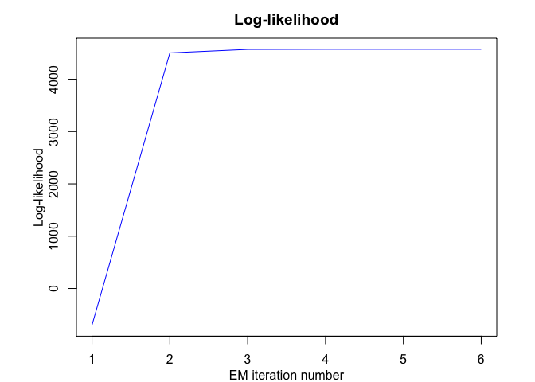

<!-- README.md is generated from README.Rmd. Please edit that file -->
<html>
<p align="center">

</p>
</html>
**SaMUraiS**: **S**t**A**tistical **M**odels for the **U**nsupe**R**vised segment**A**t**I**on of time-**S**eries
=================================================================================================================

<!-- badges: start -->
[](https://travis-ci.org/fchamroukhi/SaMUraiS) <!-- badges: end -->

samurais is an open source toolbox including many original and flexible user-friendly statistical latent variable models and unsupervised algorithms to segment and represent, time-series data (univariate or multivariate), and more generally, longitudinal data which include regime changes.

Our samurais use mainly the following efficient "sword" packages to segment data:

-   RHLP;
-   HMM/HMMR;
-   PWR;
-   MRHLP;
-   MHMMR.

The models and algorithms are developed and written in Matlab by Faicel Chamroukhi, and translated and designed into R packages by Florian Lecocq, Marius Bartcus and Faicel Chamroukhi.

Installation
============

You can install the **samurais** package from [GitHub](https://github.com/fchamroukhi/SaMUraiS) with:

``` r
# install.packages("devtools")
devtools::install_github("fchamroukhi/SaMUraiS")
```

To build *vignettes* for examples of usage, type the command below instead:

``` r
# install.packages("devtools")
devtools::install_github("fchamroukhi/SaMUraiS", 
                         build_opts = c("--no-resave-data", "--no-manual"), 
                         build_vignettes = TRUE)
```

Use the following command to display vignettes:

``` r
browseVignettes("samurais")
```

Usage
=====

<details> <summary>RHLP</summary>

``` r
library(samurais)

data("univtoydataset")

K <- 5 # Number of regimes (mixture components)
p <- 3 # Dimension of beta (order of the polynomial regressors)
q <- 1 # Dimension of w (order of the logistic regression: to be set to 1 for segmentation)
variance_type <- "heteroskedastic" # "heteroskedastic" or "homoskedastic" model

n_tries <- 1
max_iter = 1500
threshold <- 1e-6
verbose <- TRUE
verbose_IRLS <- FALSE

rhlp <- emRHLP(univtoydataset$x, univtoydataset$y, K, p, q, 
               variance_type, n_tries, max_iter, threshold, 
               verbose, verbose_IRLS)
#> EM: Iteration : 1 || log-likelihood : -2119.27308534609
#> EM: Iteration : 2 || log-likelihood : -1149.01040321999
#> EM: Iteration : 3 || log-likelihood : -1118.20384281234
#> EM: Iteration : 4 || log-likelihood : -1096.88260636121
#> EM: Iteration : 5 || log-likelihood : -1067.55719357295
#> EM: Iteration : 6 || log-likelihood : -1037.26620122646
#> EM: Iteration : 7 || log-likelihood : -1022.71743069484
#> EM: Iteration : 8 || log-likelihood : -1006.11825447077
#> EM: Iteration : 9 || log-likelihood : -1001.18491883952
#> EM: Iteration : 10 || log-likelihood : -1000.91250763556
#> EM: Iteration : 11 || log-likelihood : -1000.62280600209
#> EM: Iteration : 12 || log-likelihood : -1000.3030988811
#> EM: Iteration : 13 || log-likelihood : -999.932334880131
#> EM: Iteration : 14 || log-likelihood : -999.484219706691
#> EM: Iteration : 15 || log-likelihood : -998.928118038989
#> EM: Iteration : 16 || log-likelihood : -998.234244664472
#> EM: Iteration : 17 || log-likelihood : -997.359536276056
#> EM: Iteration : 18 || log-likelihood : -996.152654857298
#> EM: Iteration : 19 || log-likelihood : -994.697863447307
#> EM: Iteration : 20 || log-likelihood : -993.186583974542
#> EM: Iteration : 21 || log-likelihood : -991.81352379631
#> EM: Iteration : 22 || log-likelihood : -990.611295217008
#> EM: Iteration : 23 || log-likelihood : -989.539226273251
#> EM: Iteration : 24 || log-likelihood : -988.55311887915
#> EM: Iteration : 25 || log-likelihood : -987.539963690533
#> EM: Iteration : 26 || log-likelihood : -986.073920116541
#> EM: Iteration : 27 || log-likelihood : -983.263549878169
#> EM: Iteration : 28 || log-likelihood : -979.340492188909
#> EM: Iteration : 29 || log-likelihood : -977.468559852711
#> EM: Iteration : 30 || log-likelihood : -976.653534236095
#> EM: Iteration : 31 || log-likelihood : -976.5893387433
#> EM: Iteration : 32 || log-likelihood : -976.589338067237

rhlp$summary()
#> ---------------------
#> Fitted RHLP model
#> ---------------------
#> 
#> RHLP model with K = 5 components:
#> 
#>  log-likelihood nu       AIC       BIC       ICL
#>       -976.5893 33 -1009.589 -1083.959 -1083.176
#> 
#> Clustering table (Number of observations in each regimes):
#> 
#>   1   2   3   4   5 
#> 100 120 200 100 150 
#> 
#> Regression coefficients:
#> 
#>       Beta(K = 1) Beta(K = 2) Beta(K = 3) Beta(K = 4) Beta(K = 5)
#> 1    6.031875e-02   -5.434903   -2.770416    120.7699    4.027542
#> X^1 -7.424718e+00  158.705091   43.879453   -474.5888   13.194261
#> X^2  2.931652e+02 -650.592347  -94.194780    597.7948  -33.760603
#> X^3 -1.823560e+03  865.329795   67.197059   -244.2386   20.402153
#> 
#> Variances:
#> 
#>  Sigma2(K = 1) Sigma2(K = 2) Sigma2(K = 3) Sigma2(K = 4) Sigma2(K = 5)
#>       1.220624      1.110243      1.079394     0.9779734      1.028332

rhlp$plot()
```


</details>

<br />

<details> <summary>HMMR</summary>

``` r
library(samurais)

data("univtoydataset")

K <- 5 # Number of regimes (states)
p <- 3 # Dimension of beta (order of the polynomial regressors)
variance_type <- "heteroskedastic" # "heteroskedastic" or "homoskedastic" model

n_tries <- 1
max_iter <- 1500
threshold <- 1e-6
verbose <- TRUE

hmmr <- emHMMR(univtoydataset$x, univtoydataset$y, K, p, variance_type, 
               n_tries, max_iter, threshold, verbose)
#> EM: Iteration : 1 || log-likelihood : -1556.39696825601
#> EM: Iteration : 2 || log-likelihood : -1022.47935723687
#> EM: Iteration : 3 || log-likelihood : -1019.51830707432
#> EM: Iteration : 4 || log-likelihood : -1019.51780361388

hmmr$summary()
#> ---------------------
#> Fitted HMMR model
#> ---------------------
#> 
#> HMMR model with K = 5 components:
#> 
#>  log-likelihood nu       AIC       BIC
#>       -1019.518 49 -1068.518 -1178.946
#> 
#> Clustering table (Number of observations in each regimes):
#> 
#>   1   2   3   4   5 
#> 100 120 200 100 150 
#> 
#> Regression coefficients:
#> 
#>       Beta(K = 1) Beta(K = 2) Beta(K = 3) Beta(K = 4) Beta(K = 5)
#> 1    6.031872e-02   -5.326689    -2.65064    120.8612    3.858683
#> X^1 -7.424715e+00  157.189455    43.13601   -474.9870   13.757279
#> X^2  2.931651e+02 -643.706204   -92.68115    598.3726  -34.384734
#> X^3 -1.823559e+03  855.171715    66.18499   -244.5175   20.632196
#> 
#> Variances:
#> 
#>  Sigma2(K = 1) Sigma2(K = 2) Sigma2(K = 3) Sigma2(K = 4) Sigma2(K = 5)
#>       1.220624      1.111487      1.080043     0.9779724      1.028399

hmmr$plot()
```


</details>

<br />

<details> <summary>PWR</summary>

``` r
library(samurais)

data("univtoydataset")

K <- 5 # Number of segments
p <- 3 # Polynomial degree

pwr <- fitPWRFisher(univtoydataset$x, univtoydataset$y, K, p)

pwr$plot()
```


</details>

<br />

<details> <summary>MRHLP</summary>

``` r
library(samurais)

data("multivtoydataset")

K <- 5 # Number of regimes (mixture components)
p <- 3 # Dimension of beta (order of the polynomial regressors)
q <- 1 # Dimension of w (order of the logistic regression: to be set to 1 for segmentation)
variance_type <- "heteroskedastic" # "heteroskedastic" or "homoskedastic" model

n_tries <- 1
max_iter <- 1500
threshold <- 1e-6
verbose <- TRUE
verbose_IRLS <- FALSE

mrhlp <- emMRHLP(multivtoydataset$x, multivtoydataset[,c("y1", "y2", "y3")], 
                 K, p, q, variance_type, n_tries, max_iter, threshold, verbose,
                 verbose_IRLS)
#> EM: Iteration : 1 || log-likelihood : -4975.54177550763
#> EM: Iteration : 2 || log-likelihood : -3108.34368262058
#> EM: Iteration : 3 || log-likelihood : -3083.17524290617
#> EM: Iteration : 4 || log-likelihood : -3052.50226046505
#> EM: Iteration : 5 || log-likelihood : -3020.60866761548
#> EM: Iteration : 6 || log-likelihood : -2967.37662637476
#> EM: Iteration : 7 || log-likelihood : -2948.61300516787
#> EM: Iteration : 8 || log-likelihood : -2945.45995948196
#> EM: Iteration : 9 || log-likelihood : -2937.99296980136
#> EM: Iteration : 10 || log-likelihood : -2924.28973590932
#> EM: Iteration : 11 || log-likelihood : -2901.25080505023
#> EM: Iteration : 12 || log-likelihood : -2859.88249265728
#> EM: Iteration : 13 || log-likelihood : -2858.05147227319
#> EM: Iteration : 14 || log-likelihood : -2856.38015373797
#> EM: Iteration : 15 || log-likelihood : -2854.68196733762
#> EM: Iteration : 16 || log-likelihood : -2852.69581368828
#> EM: Iteration : 17 || log-likelihood : -2849.93140687413
#> EM: Iteration : 18 || log-likelihood : -2846.34467342533
#> EM: Iteration : 19 || log-likelihood : -2843.82658697638
#> EM: Iteration : 20 || log-likelihood : -2842.75921489778
#> EM: Iteration : 21 || log-likelihood : -2842.2361309076
#> EM: Iteration : 22 || log-likelihood : -2841.91343876731
#> EM: Iteration : 23 || log-likelihood : -2841.66202744546
#> EM: Iteration : 24 || log-likelihood : -2841.41784741157
#> EM: Iteration : 25 || log-likelihood : -2841.14668922972
#> EM: Iteration : 26 || log-likelihood : -2840.82033081985
#> EM: Iteration : 27 || log-likelihood : -2840.39141033072
#> EM: Iteration : 28 || log-likelihood : -2839.74532802897
#> EM: Iteration : 29 || log-likelihood : -2838.62532237046
#> EM: Iteration : 30 || log-likelihood : -2836.64319641069
#> EM: Iteration : 31 || log-likelihood : -2833.87378876047
#> EM: Iteration : 32 || log-likelihood : -2831.75584262499
#> EM: Iteration : 33 || log-likelihood : -2831.16293539695
#> EM: Iteration : 34 || log-likelihood : -2831.0646784204
#> EM: Iteration : 35 || log-likelihood : -2831.06467491195

mrhlp$summary()
#> ----------------------
#> Fitted MRHLP model
#> ----------------------
#> 
#> MRHLP model with K = 5 regimes
#> 
#>  log-likelihood nu       AIC       BIC       ICL
#>       -2831.065 98 -2929.065 -3149.921 -3149.146
#> 
#> Clustering table:
#>   1   2   3   4   5 
#> 100 120 200 100 150 
#> 
#> 
#> ------------------
#> Regime 1 (K = 1):
#> 
#> Regression coefficients:
#> 
#>       Beta(d = 1)   Beta(d = 2) Beta(d = 3)
#> 1       0.4466558     0.8104534    -2.36719
#> X^1   -25.5100013   -20.5995360    32.75195
#> X^2   413.8717640   498.0085618  -541.38904
#> X^3 -1811.4612012 -2477.5546420  2523.64723
#> 
#> Covariance matrix:
#>                                   
#>  1.17712613  0.1114059  0.07303969
#>  0.11140591  0.8394152 -0.02442220
#>  0.07303969 -0.0244222  0.85240361
#> ------------------
#> Regime 2 (K = 2):
#> 
#> Regression coefficients:
#> 
#>     Beta(d = 1) Beta(d = 2) Beta(d = 3)
#> 1      21.30187   -4.108239    1.838238
#> X^1  -199.86512  112.953325  112.257782
#> X^2   905.60445 -449.623857 -493.914613
#> X^3 -1316.42937  581.197948  694.872075
#> 
#> Covariance matrix:
#>                                     
#>   1.0409982 -0.180821350 0.137568024
#>  -0.1808214  1.042169409 0.009699162
#>   0.1375680  0.009699162 0.754147599
#> ------------------
#> Regime 3 (K = 3):
#> 
#> Regression coefficients:
#> 
#>     Beta(d = 1) Beta(d = 2) Beta(d = 3)
#> 1     4.4721830    9.349642    6.349724
#> X^1   0.7467282  -33.315977   17.837763
#> X^2 -11.9302818   96.730621  -51.086769
#> X^3  16.1571109  -85.951201   42.760070
#> 
#> Covariance matrix:
#>                                     
#>   1.02026230 -0.04094457 -0.02544812
#>  -0.04094457  1.15656511  0.02852275
#>  -0.02544812  0.02852275  0.99750511
#> ------------------
#> Regime 4 (K = 4):
#> 
#> Regression coefficients:
#> 
#>     Beta(d = 1) Beta(d = 2) Beta(d = 3)
#> 1      1267.288   -840.5119   -10.37768
#> X^1   -5458.816   3613.7273    19.40201
#> X^2    7813.122  -5184.1100    14.37103
#> X^3   -3718.619   2475.7168   -29.55020
#> 
#> Covariance matrix:
#>                                       
#>   0.822157811  0.006792726 -0.03667011
#>   0.006792726  1.093351047 -0.07477892
#>  -0.036670114 -0.074778924  0.85425249
#> ------------------
#> Regime 5 (K = 5):
#> 
#> Regression coefficients:
#> 
#>     Beta(d = 1) Beta(d = 2) Beta(d = 3)
#> 1      194.7894    12.88268    483.8383
#> X^1   -658.4685   -45.73544  -1634.9482
#> X^2    753.1086    61.92925   1858.1529
#> X^3   -286.1078   -27.37495   -702.9064
#> 
#> Covariance matrix:
#>                                 
#>  1.1282728 0.25684915 0.02034990
#>  0.2568491 1.21055927 0.04414336
#>  0.0203499 0.04414336 0.77644297

mrhlp$plot()
```


</details>

<br />

<details> <summary>MHMMR</summary>

``` r
library(samurais)

data("multivtoydataset")

K <- 5 # Number of regimes (states)
p <- 3 # Dimension of beta (order of the polynomial regressors)
variance_type <- "heteroskedastic" # "heteroskedastic" or "homoskedastic" model

n_tries <- 1
max_iter <- 1500
threshold <- 1e-6
verbose <- TRUE

mhmmr <- emMHMMR(multivtoydataset$x, multivtoydataset[, c("y1", "y2", "y3")],
                 K, p, variance_type, n_tries, max_iter, threshold, verbose)
#> EM: Iteration : 1 || log-likelihood : -4425.29307889945
#> EM: Iteration : 2 || log-likelihood : -2876.80418310609
#> EM: Iteration : 3 || log-likelihood : -2876.69073409991
#> EM: Iteration : 4 || log-likelihood : -2876.69055273039

mhmmr$summary()
#> ----------------------
#> Fitted MHMMR model
#> ----------------------
#> 
#> MHMMR model with K = 5 regimes
#> 
#>  log-likelihood  nu       AIC       BIC
#>       -2876.691 114 -2990.691 -3247.605
#> 
#> Clustering table:
#>   1   2   3   4   5 
#> 100 120 200 100 150 
#> 
#> 
#> ------------------
#> Regime 1 (K = 1):
#> 
#> Regression coefficients:
#> 
#>     Beta(d = 1) Beta(d = 2) Beta(d = 3)
#> 1     0.1595884   0.4201364  -1.9684451
#> X^1  -1.7145325  11.7544140  -0.3006142
#> X^2  10.6877091 -50.1877444  18.6445441
#> X^3   2.3981783 -11.3098522   4.1479356
#> 
#> Covariance matrix:
#>                                    
#>  1.19029438  0.12929675  0.05476253
#>  0.12929675  0.86375075 -0.04927306
#>  0.05476253 -0.04927306  0.87780108
#> ------------------
#> Regime 2 (K = 2):
#> 
#> Regression coefficients:
#> 
#>     Beta(d = 1) Beta(d = 2) Beta(d = 3)
#> 1       5.15889     3.33862   10.451892
#> X^1    15.56177    13.57089   -2.723323
#> X^2   -23.21384   -21.11255    1.987222
#> X^3   -19.14783   -17.33469    2.005997
#> 
#> Covariance matrix:
#>                                   
#>   1.0610207 -0.18930477 0.12778054
#>  -0.1893048  1.04687322 0.01497034
#>   0.1277805  0.01497034 0.76036609
#> ------------------
#> Regime 3 (K = 3):
#> 
#> Regression coefficients:
#> 
#>     Beta(d = 1) Beta(d = 2) Beta(d = 3)
#> 1      4.795937    9.292094    6.795783
#> X^1   -1.263151  -32.958041   15.068148
#> X^2   -7.837624   96.000594  -45.446277
#> X^3   13.420270  -85.462348   38.987695
#> 
#> Covariance matrix:
#>                                     
#>   1.02087804 -0.04142857 -0.02435233
#>  -0.04142857  1.15623166  0.02795799
#>  -0.02435233  0.02795799  0.99869029
#> ------------------
#> Regime 4 (K = 4):
#> 
#> Regression coefficients:
#> 
#>     Beta(d = 1) Beta(d = 2) Beta(d = 3)
#> 1     -7.021181    4.833214  -11.605950
#> X^1   11.317211  -15.023656   24.674451
#> X^2    3.910821   -3.672965    6.844172
#> X^3  -10.872747   16.089951  -25.976569
#> 
#> Covariance matrix:
#>                                     
#>   0.87900680 -0.03091285 -0.03661533
#>  -0.03091285  1.11837399 -0.07481527
#>  -0.03661533 -0.07481527  0.85426254
#> ------------------
#> Regime 5 (K = 5):
#> 
#> Regression coefficients:
#> 
#>     Beta(d = 1) Beta(d = 2) Beta(d = 3)
#> 1    -0.8791755   -2.313216 -0.09479267
#> X^1   5.9187901    5.861810  8.23344181
#> X^2   3.5548127    3.717845  4.33488866
#> X^3  -5.1244038   -5.553392 -7.97025598
#> 
#> Covariance matrix:
#>                                  
#>  1.13188125 0.25712861 0.02924967
#>  0.25712861 1.21059097 0.04483453
#>  0.02924967 0.04483453 0.79846413

mhmmr$plot()
```



</details>

References
==========

Chamroukhi, F., and Hien D. Nguyen. 2019. “Model-Based Clustering and Classification of Functional Data.” *Wiley Interdisciplinary Reviews: Data Mining and Knowledge Discovery*. <https://doi.org/10.1002/widm.1298>.

Chamroukhi, F. 2015. “Statistical Learning of Latent Data Models for Complex Data Analysis.” Habilitation Thesis (HDR), Université de Toulon. <https://chamroukhi.com/Dossier/FChamroukhi-Habilitation.pdf>.

Trabelsi, D., S. Mohammed, F. Chamroukhi, L. Oukhellou, and Y. Amirat. 2013. “An Unsupervised Approach for Automatic Activity Recognition Based on Hidden Markov Model Regression.” *IEEE Transactions on Automation Science and Engineering* 3 (10): 829–335. <https://chamroukhi.com/papers/Chamroukhi-MHMMR-IeeeTase.pdf>.

Chamroukhi, F., D. Trabelsi, S. Mohammed, L. Oukhellou, and Y. Amirat. 2013. “Joint Segmentation of Multivariate Time Series with Hidden Process Regression for Human Activity Recognition.” *Neurocomputing* 120: 633–44. <https://chamroukhi.com/papers/chamroukhi_et_al_neucomp2013b.pdf>.

Chamroukhi, F., A. Samé, G. Govaert, and P. Aknin. 2010. “A Hidden Process Regression Model for Functional Data Description. Application to Curve Discrimination.” *Neurocomputing* 73 (7-9): 1210–21. <https://chamroukhi.com/papers/chamroukhi_neucomp_2010.pdf>.

Chamroukhi, F. 2010. “Hidden Process Regression for Curve Modeling, Classification and Tracking.” Ph.D. Thesis, Université de Technologie de Compiègne. <https://chamroukhi.com/papers/FChamroukhi-Thesis.pdf>.

Chamroukhi, F., A. Samé, G. Govaert, and P. Aknin. 2009. “Time Series Modeling by a Regression Approach Based on a Latent Process.” *Neural Networks* 22 (5-6): 593–602. <https://chamroukhi.com/papers/Chamroukhi_Neural_Networks_2009.pdf>.
